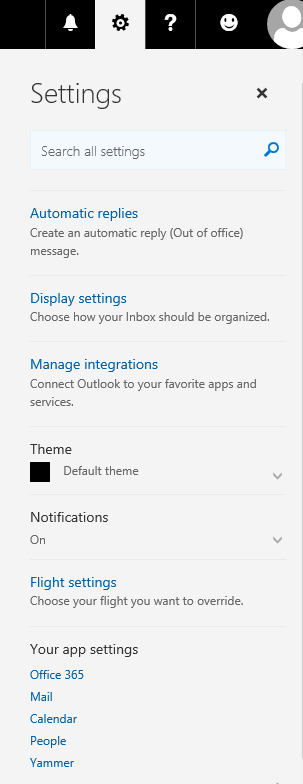
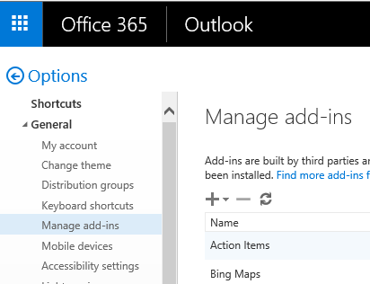

# Outlook add-in on send code sample

Learn how to check for restricted words in an Outlook email message body, add a recipient to the CC line and check that there is a subject in the email on send.

>**Note:** 

* The on send feature is currently supported for Outlook on the web in Office 365 only. 
* To learn about the on send feature, see [On send feature for Outlook add-ins](https://dev.office.com/docs/add-ins/outlook/outlook-on-send-addins).  
* For a code walkthrough, see [Code examples](https://docs.microsoft.com/en-us/outlook/add-ins/outlook-on-send-addins#code-examples).

## Table of Contents
* [Change history](#change-history)
* [Prerequisites](#prerequisites)
* [Configuring and installing the sample](#configure)
* [Upload the manifests](#manifests)
* [Run the add-in](#test-the-add-in)
* [Questions and comments](#questions-and-comments)
* [Additional resources](#additional-resources)

## Change history

April 2017

* Initial version.

## Prerequisites

* A trusted web server to host the sample files. The server must be able to accept SSL-protected requests (https) and have a valid SSL certificate.
* An Office 365 email account.
* Enable the on send feature - by default, the on send functionality is disabled. Add-ins for Outlook on the web that use the on send feature will run for users who are assigned an Outlook on the web mailbox policy that has the **OnSendAddinsEnabled** flag set to **true**.  Administrators can enable on send by running Exchange Online PowerShell cmdlets. To learn what cmdlets to run, see [Installing Outlook add-ins that use on send](https://docs.microsoft.com/en-us/outlook/add-ins/outlook-on-send-addins#installing-outlook-add-ins-that-use-on-send)

## Configuring and installing the sample

1. Download or fork the repository.
2. Open app.js. In  `addCCOnSend` function, change `Contoso@contoso.onmicrosoft.com` to your own email address.
2. Deploy the add-in files to a directory on your web server. The files to upload are app.js and index.html.
3. Open `Contoso Message Body Checker.xml` and `Contoso Subject and CC Checker.xml` manifest files in a text editor. Replace all instances of `https://localhost:3000` with the HTTPS URL of the directory where you uploaded the files in the previous step. Save your changes.

   >  For more information about:
   * running Outllook add-ins, see [Running an Outlook add-in in an Office 365 account](https://dev.outlook.com/MailAppsGettingStarted/GetStarted)
   * manifests, see [Outlook add-in manifests](https://dev.office.com/docs/add-ins/outlook/manifests/manifests)

## Upload the manifests

1. Logon to [Outlook Web App](https://outlook.office365.com).
2. Click **Settings** (the gear cog in the upper right corner of the page) to open the **Settings** page (as shown in the following screenshot).

  

3. In **Your app settings** section of the **Settings** page, choose **Mail**.
4. In the **Options** page, select **General** and then **Manage add-ins** (as shown in the following screenshot).

 

5. On the **Manage add-ins** page, click the '+' icon, select **Add from file**. Browse to the `Contoso Message Body Checker.xml` manifest file included in the project. Click **Next**, then click **Install**. Finally, click **OK**.
6. Repeat step 5 to install `Contoso Subject and CC Checker.xml` manifest file.
7. Return to the Mail view in Outlook Web App.

## Run the add-in

### Subject and CC Checker

1. Compose a new Outlook Web App email message. 
2. Leave the subject line blank.
3. Add a recipient in the **To** line. 
4. Click **Send**. 

* A carbon copy is added to the CC line.  In this sample, it's `Contoso@contoso.onmicrosoft.com`.
* The email is blocked from being sent and an error message displayed on the information bar to notify sender to add a subject. (as shown in the following screenshot).  

  

6. Add a subject line.
7. A `[Checked]:` is added to the front of the subject line and email is sent.

### Message Body Checker

1. Create a new Outlook Web App email message. 
2. In the body of the message, type `blockedword`, `blockedword1`  or `blockedword2`.  (These are the array of restricted words in the app.js file of the `checkBodyOnlyOnSendCallBack` function).
3. Add a recipient in the **To** line. 
5. Click **Send**.  

* The email is blocked from being sent because of blocked words found in the message body.  
* An error message displayed on the information bar to notify sender of blocked words found (as shown in the following screenshot).  

 

5. To send the email, remove the blocked words.

## Questions and comments

We'd love to get your feedback about this sample. You can send your feedback to us in the *Issues* section of this repository.

Questions about Microsoft Office 365 development in general should be posted to [Stack Overflow](http://stackoverflow.com/questions/tagged/office-js+API). If your question is about the Office JavaScript APIs, make sure that your questions are tagged with [office-js] and [API].

## Additional resources

* [Office add-in documentation](https://msdn.microsoft.com/en-us/library/office/jj220060.aspx)
* [Office Dev Center](http://dev.office.com/)
* More Office Add-in samples at [OfficeDev on Github](https://github.com/officedev)

## Copyright
Copyright (c) 2016 Microsoft Corporation. All rights reserved.

This project has adopted the [Microsoft Open Source Code of Conduct](https://opensource.microsoft.com/codeofconduct/). For more information, see the [Code of Conduct FAQ](https://opensource.microsoft.com/codeofconduct/faq/) or contact [opencode@microsoft.com](mailto:opencode@microsoft.com) with any additional questions or comments.
